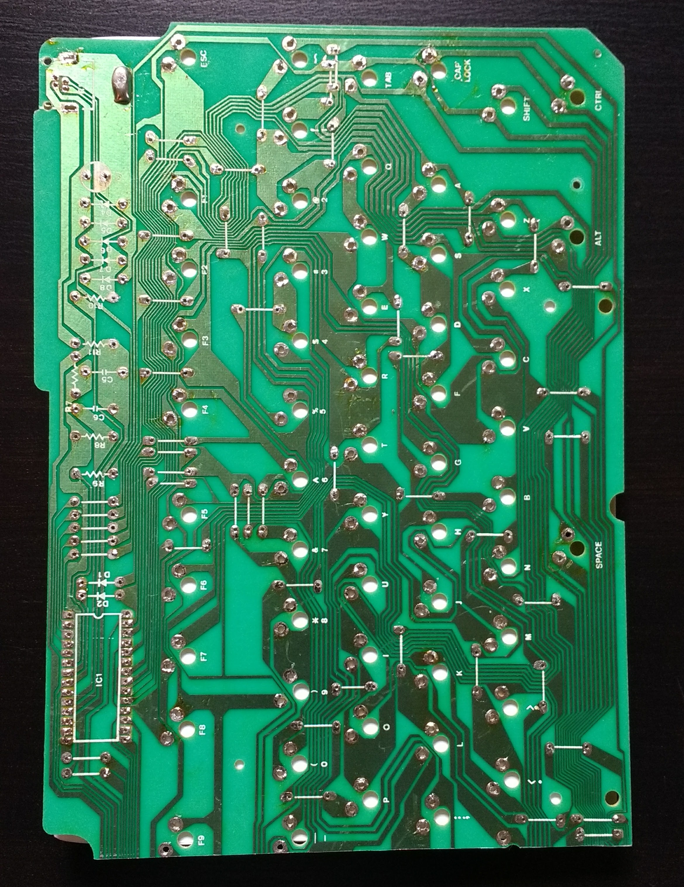
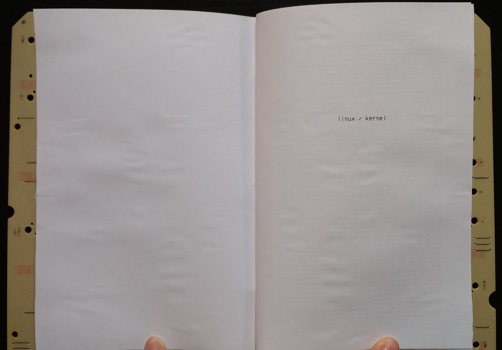
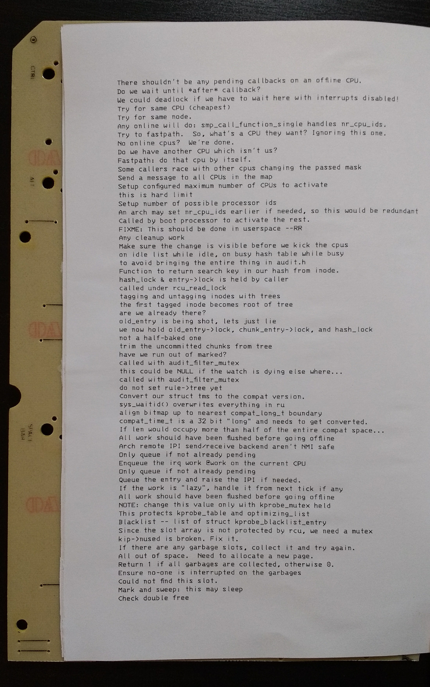
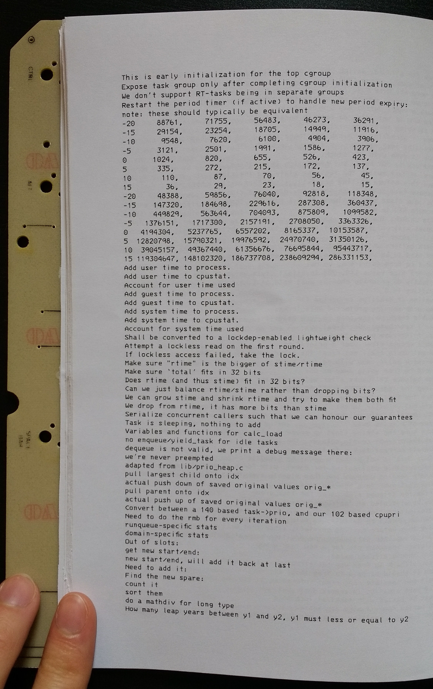
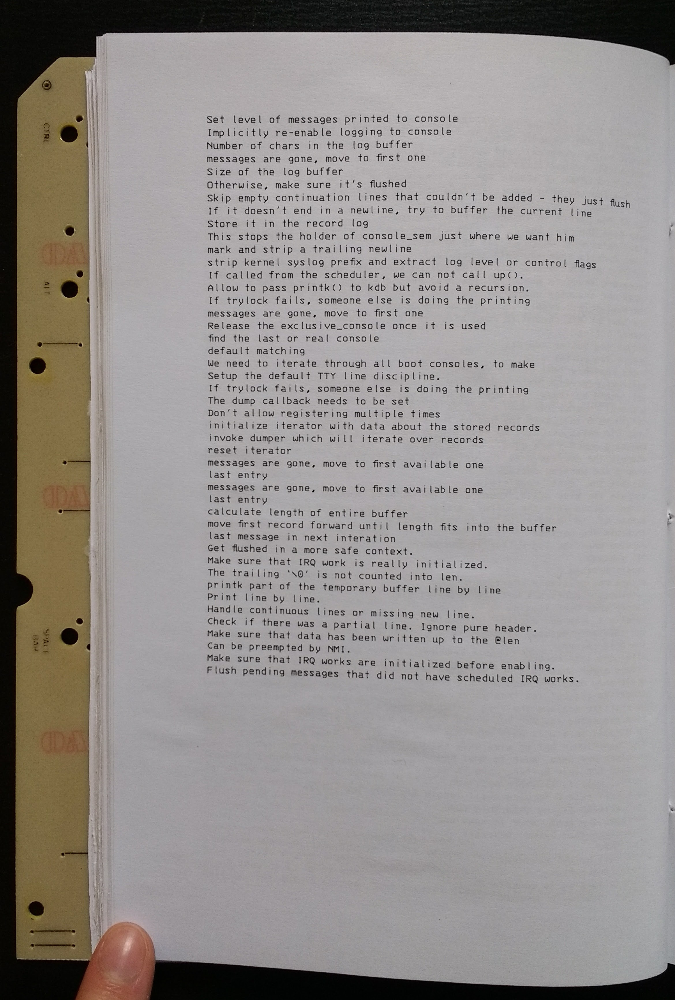
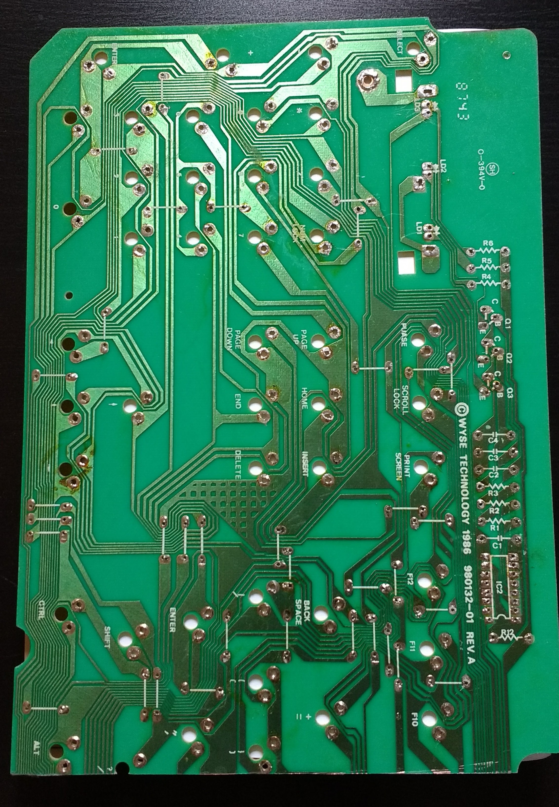

<h3 style='text-align: center'>Front cover</h3>

<h3 style='text-align: center'>Title page</h3>

<h3 style='text-align: center'>First page</h3>

<h3 style='text-align: center'>Interesting page</h3>

<h3 style='text-align: center'>Last page</h3>

<h3 style='text-align: center'>Back cover</h3>

